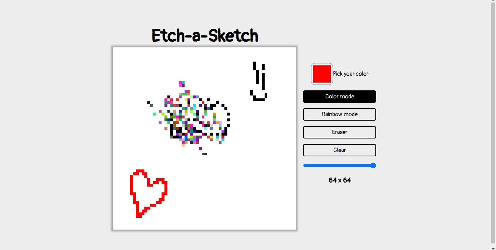

# etch-a-sketch

# Learnings

- Learned how to use display grid, to set a grid with specified dimentions.
- Learned another form to apply functionality to buttons by using .onclick instead of adding an event listener.
- Learned how to use inputs like sliders and color inputs, on sliders using .onmousemove, .onmouseup and .onmousedown.
- Practiced creating HTML elements from Js code.
- Used for the first time window.onload to preset values when loading the page.
